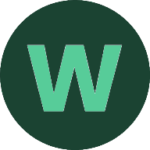
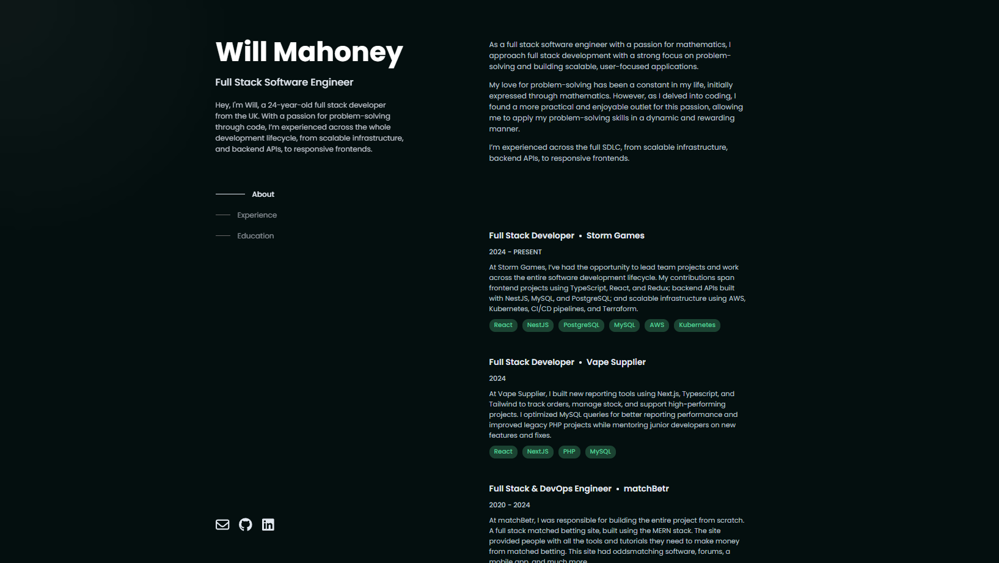

<!-- Title Container -->

  <!-- Logo -->
  

  <!-- Title -->
  <h1 style="margin-top: 10px">Will Mahoney</h1>

  <!-- Subtitle -->
  
v1 of willmahoney.co, built using React, and hosted with Vercel. Design inspired by BrittanyChiang.com.

<!-- Main Content -->

<!-- Image -->

## About

<!-- Text Paragraph -->
My portfolio tells you about my journey as a developer so far, and how you can get in touch with me. Thank you for taking a look.

<!-- Grid for Color Scheme -->
### Color Scheme
| Color Name | Hex Code |
|------------|----------|
| Green      | #57CC99  |
| Dark Green | #1B4332  |
| White      | #FFFFFF  |
| Pri Font   | #E2E8FO  |
| Sec Font   | #BEC3CC  |
| Background | #040F0F  |

<!-- Feel free to add more sections or customize the content according to your needs -->